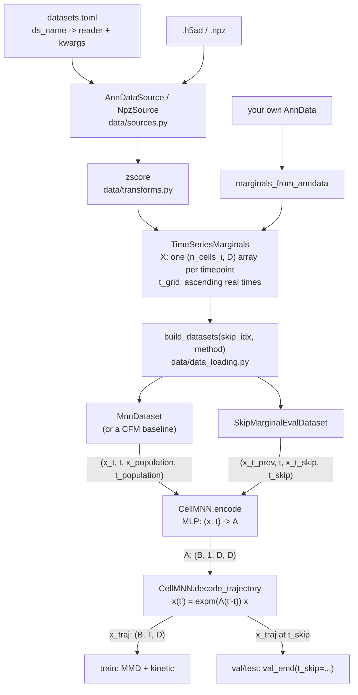

# Architecture

Everything above `TimeSeriesMarginals` knows about files and formats but nothing about
training. Everything below it knows about training but nothing about files. That one
type is the entire interface between the two halves.

`skip_idx` names the held-out timepoint: training never sees it, and validation scores
the model by evolving the previous marginal forward to it, with exact Wasserstein-1.

Three extension points follow from the shape above:

- A dataset an existing reader handles is **one table in `datasets.toml`** — no code.
- A new kind of data is **one class in `sources.py`** plus one `SOURCE_TYPES` entry.
