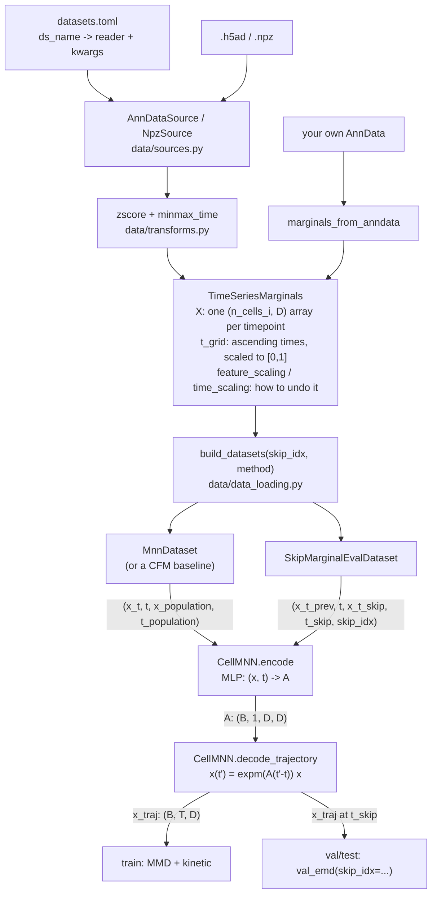

# Architecture

Everything above `TimeSeriesMarginals` knows about files and formats but nothing about
training. Everything below it knows about training but nothing about files. That one
type is the entire interface between the two halves.



`skip_idx` names the held-out timepoint: training never sees it, and validation scores
the model by evolving the previous marginal forward to it, with exact Wasserstein-1.

Three extension points follow from the shape above:

- A dataset an existing reader handles is **one table in `datasets.toml`** — no code.
- A new kind of data is **one class in `sources.py`** plus one `SOURCE_TYPES` entry.

## CLI

Both training scripts live under `src/cell_mnn/cli/` and need `PYTHONPATH=src` until
packaging lands:

```bash
PYTHONPATH=src python -m cell_mnn.cli.train_mnn --skip_idx 1 --ds_name embryoid
PYTHONPATH=src python -m cell_mnn.cli.train_cfm --skip_idx 1 --ds_name embryoid --method i-cfm
```

Every flag has a hardcoded default; pass only the ones you want to change. To reuse a
set of overrides, save them as a flat TOML (`flag_name = value`) and point `--config`
at it — CLI flags still win over the file, and the file wins over the hardcoded
defaults:

```bash
PYTHONPATH=src python -m cell_mnn.cli.train_mnn --config configs/mnn/embryoid_baseline.toml
```

See `CLAUDE.md` for the full flag reference.
