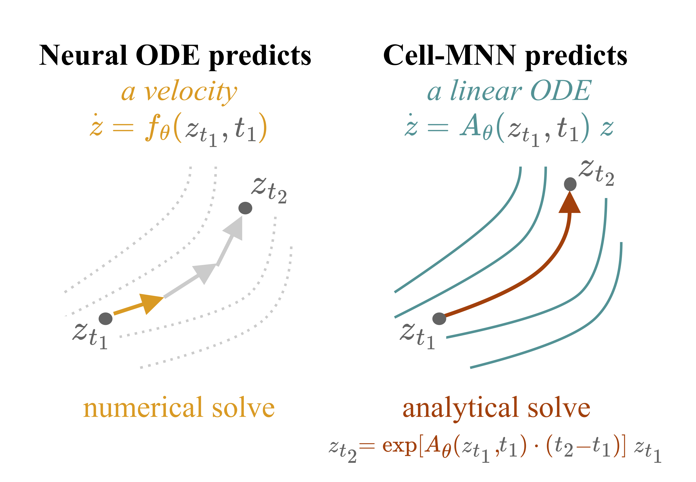
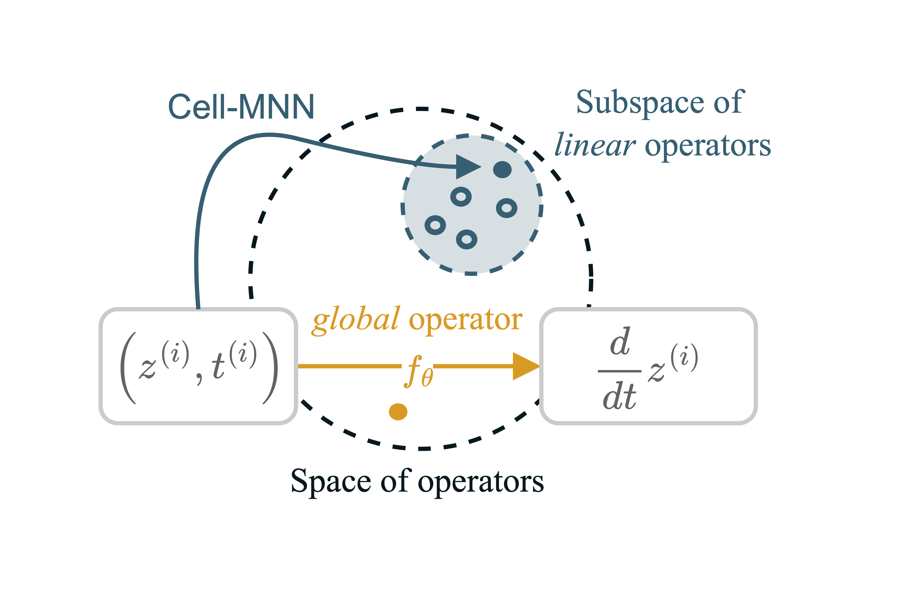

# Learning Explicit Single-cell Dynamics Using ODE Representations (ICLR 2026)
 [**Getting Started**](#getting-started) | [**OpenReview**](https://openreview.net/forum?id=DzSNH5APPl) | [**arXiv**](https://arxiv.org/abs/2510.02903) | [**Cite**](#cite) 
# Overview
This repository contains the implementation of *Cell Mechanistic Neural Networks* (Cell-MNN) introduced in [1]. Cell-MNN is an encoder-decoder architecture whose latent representation is a locally linearized ODE governing the dynamics of cellular evolution from stem to tissue cells in gene expression space. Cell-MNN is fully end-to-end (besides a standard PCA pre-processing) and its ODE representation learns interpretable gene interactions.

<p align="center">
    
    <br>
    <strong>Figure 1:</strong> Like a hypernetwork, Cell-MNN predicts a linear operator that approximates the local dynamics explicitly, whereas Neural ODEs and Flow Matching models only output a velocity.
</p>
<p align="center">
    
    <br>
    <strong>Figure 2:</strong> Visualization of the meta-learning task of Cell-MNN's encoder: Rather than directly predicting the velocity at a given operating point, the MLP of Cell-MNN maps to the space of linear operators. 
</p>


# Getting Started

## Create Environment
```bash
conda env create -f environment.yml
```

```bash
conda activate cell_mnn_env
```

## Data
1. Download the *Embryoid*, *Multi* and *Cite* dataset using the helper script. 
```bash
chmod +x data/download_data.sh 
./data/download_data.sh
```
2. It will place the data files into dataset-specific folders in `lib/data/...` so that the paths are:
- multi: `data/multidata/...`
- embryoid: `data/ebdata/...`
- cite: `data/citedata/...`

# Train and Evaluate
Train a Cell-MNN with left-out marginal at `skip_day_idx=1, 2, ..., t_max - 1` on dataset `embryoid`, `cite` or `multi`
```bash
python train_mnn.py --skip_day_idx $IDX --ds_name embryoid 
```
After training has finished a final evaluation will run automatically as part of the script and logged to weights and biases. All other default arguments correspond to the hyperparameters used in the paper.

## Setting Eigenvalue to Zero
To train and evaluate a model with certain number of eigenvalues set to zero add flag `--num_const_dims 1`
to the training command. 

## Amortized Training
Specify the following arguments for training on Cite and Multi jointly and evalute on `$Eval_DS`
```bash
python train_mnn.py --skip_day_idx $IDX --ds_name mix --val_ds_name $Eval_DS --width 128
```

## Inflated Datasets
Using the script `data/inflate_data.py` the original datasets can be inflated as described in the paper. They have to be moved in the corresponding dataset folder and can then be trained on using 
```bash
python train_mnn.py --skip_day_idx $IDX --ds_name embryoid_inflated 
```

## Benchmarks
The script `train_cfm.py` contains the code used for obtaining results for I-CFM and OT-CFM. It has the same interface as the `train_mnn.py` script. The script `pure_OT_interpolation.py` contains the code for the OT-Interpolate method.

# Validation on TRRUST Database
The script `validate_on_trrust.py` implements the experiment to validate the directionality of learned interactions against the TRRUST database. For easy access, we already provide pretrained model weights in `trained_models/...`. Note that these have been trained on the less preprocessed version of the Embryoid dataset and are thereby not the same as for the interpolation experiment. 

To perform the experiment, run 
```bash
python validate_on_trrust.py --gene HMGA1 --models_folder pre_trained_models/cellmnn
```
or set `cell_mnn` to `cellmnn_1ev0` for the model with one eigenvalue forced to zero. 
The gene argument specifies which gene to validate the interactions for. 
You can select any gene for which the ground truth is contained in `data/tf_targets_trrust`.

# Cite
If you found this library useful, please consider citing:
```bibtex
@inproceedings{
    vonbassewitz2026oderepresentations,
    title={Learning Explicit Single-Cell Dynamics Using ODE Representations},
    author={Jan-Philipp von Bassewitz and Adeel Pervez and Marco Fumero and Matthew Robinson and Theofanis Karaletsos and Francesco Locatello},
    booktitle={The Fourteenth International Conference on Learning Representations},
    year={2026},
    url={https://openreview.net/forum?id=DzSNH5APPl}
}
```

# References
<a id="1">[1]</a>
von Bassewitz J.-P., Pervez A., Fumero M., Robinson M., Karaletsos T., Locatello F.;
Learning Explicit Single-Cell Dynamics Using ODE Representations;
The Fourteenth International Conference on Learning Representations (ICLR), 2026.
[OpenReview link](https://openreview.net/forum?id=DzSNH5APPl)